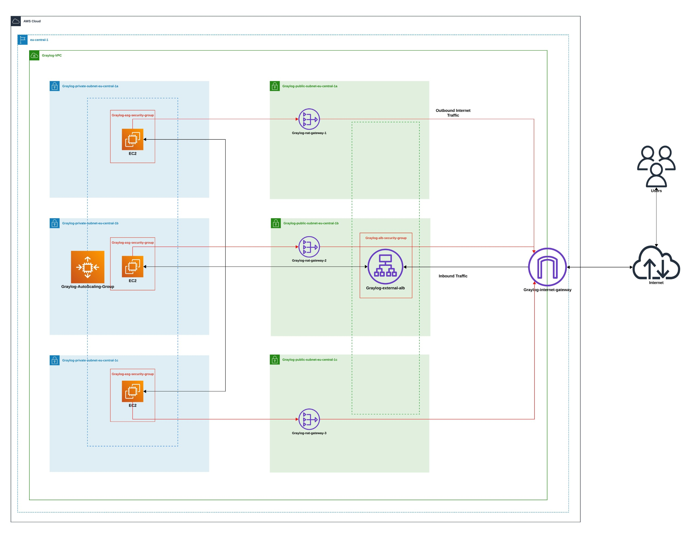
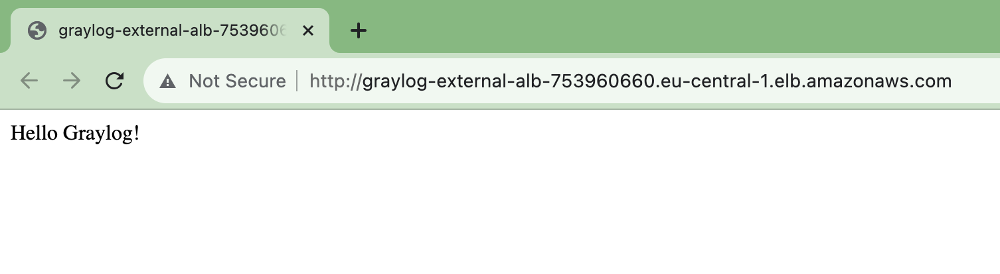

# Deploying Hello Graylog on AWS using Terraform
This README.md file provides step-by-step instructions on how to deploy the Hello Graylog application on AWS using Terraform. The deployment process includes creating a VPC with appropriate subnets & route tables, EC2 instance where the application is hosted, security groups, an Auto Scaling Group & an Application Load Balancer along with supporting componenets.

## Prerequisites:
Before diving in, ensure you have the following prerequisites in place:

* AWS account where you can deploy the application.
* IAM User with Access Key & Secret Key.
* Terraform installed on your local machine.

## Deployment Steps:
1. Initialize Terraform in your project directory:
```
terraform init
```

2. Verify the execution plan that shows the proposed changes to the infrastructure.
```
terraform plan
```

3. Deploying the infrastructure,provide "yes" as input when asked & hit enter.

```
terraform apply
```
## Assumptions:
* The architecture ensures high availability within a single region, deploying resources like the ALB, NAT Gateway, and EC2 instances across three Availability Zones (AZs).
* The application is accessible via the ALB DNS on port 80. For enhanced security, it is recommended to implement HTTPS by acquiring a domain, certificate, and setting up DNS records.
* A NAT Gateway is deployed to enable EC2 instances in private subnets to access the internet for application and OS security updates.

## Resources Created:
* _Network_: There is a dedicated [Graylog_Network.tf](Graylog_Network.tf) file which builds the network components, including VPC, Public and Private Subnets, Internet Gateway, Public and Private Route Tables, NatGateway, etc.
* _Autoscaling Groups_: A separate [GrayLog_ASG.tf](GrayLog_ASG.tf) file creates the Autoscaling group, Launch Template and its supported components (IAM Role, Security Group, AMI)
* _Application Load Balancer_: Another Terraform [GrayLog_LoadBalancer.tf](GrayLog_LoadBalancer.tf) file sets up an external ALB along with Listener, target group and a security group.

### Note:
* _vairables.tf_: There is a dedicated [variables.tf](variables.tf) file which contains all the variables required to deploy the application. It make the code resuable and reduce the maintenance effort.
* _provider.tf_: There is a [provider.tf](provider.tf) file that contains the AWS provider definition.
* _script.sh_: This file [script.sh](script.sh) contains the linux script to install and start HTTP service and SSM agent to manage EC2 instance.


## Architecture Diagram
Below is the High level architecture diagram for application setup:

* The Internet Gateway (Graylog-internet-gateway) handles incoming traffic and forwards requests to the ALB, protected by the security group (Graylog-alb-security-group).
* Traffic is routed to EC2 instances hosted in private subnets and distributed across three Availability Zones using target groups.
* The application runs on the EC2 instance and is served upon a successful GET HTTP request, as demonstrated in the output  image.


## Cleanup
Don't forget to destroy the AWS resources when you're done:
```
terraform destroy
```

## References
* [AWS Terraform](https://registry.terraform.io/providers/hashicorp/aws/latest/docs)
* [AWS Well-Architected](https://aws.amazon.com/architecture/well-architected/?wa-lens-whitepapers.sort-by=item.additionalFields.sortDate&wa-lens-whitepapers.sort-order=desc&wa-guidance-whitepapers.sort-by=item.additionalFields.sortDate&wa-guidance-whitepapers.sort-order=desc)